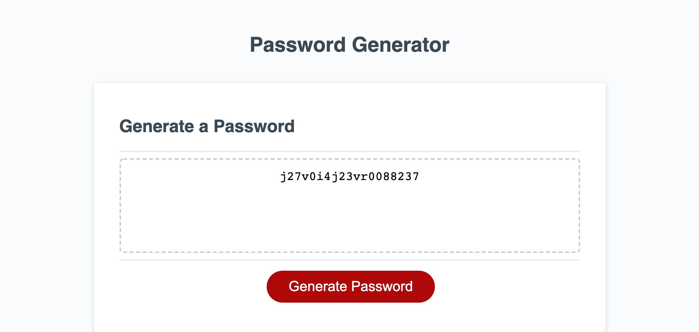

# Random Password Generator Application

## About

The Random Password Generator Application assignment is a fun one page application the uses and combines a plethora of basic JavaScript concepts:

- Functions
- Arrays
- Objects
- Recursion
- Prompts
- Validation
- EventListeners

The current iteration of the application is fairly optimized by implementing functions where possible in order to DRY (don't repeat yourself) and by using objects to keep information bundled together.

---

## User Story

```
* AS AN employee with access to sensitive data
* I WANT to randomly generate a password that meets certain criteria
* SO THAT I can create a strong password that provides greater security
```

## Acceptance Criteria

```
* GIVEN I need a new, secure password
* WHEN I click the button to generate a password
* THEN I am presented with a series of prompts for password criteria
* WHEN prompted for password criteria
* THEN I select which criteria to include in the password
* WHEN prompted for the length of the password
* THEN I choose a length of at least 8 characters and no more than 128 characters
* WHEN prompted for character types to include in the password
* THEN I choose lowercase, uppercase, numeric, and/or special characters
* WHEN I answer each prompt
* THEN my input should be validated and at least one character type should be selected
* WHEN all prompts are answered
* THEN a password is generated that matches the selected criteria
* WHEN the password is generated
* THEN the password is either displayed in an alert or written to the page
```

---

## Screenshot



## Link to Deployed Application

https://allanp94.github.io/03-JSPasswordGenerator/
